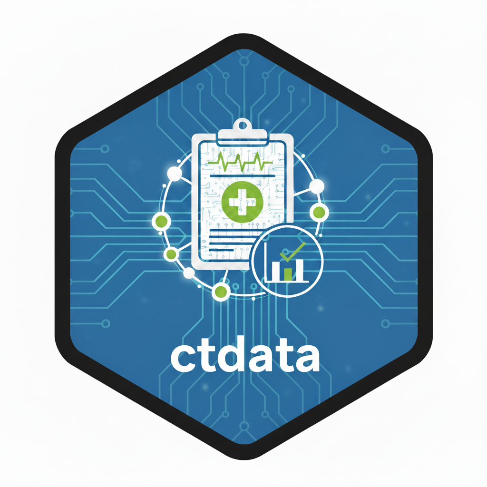

<!-- README.md is generated from README.Rmd. Please edit that file -->

# clinTrialData 

<!-- badges: start -->

[](https://github.com/Lovemore-Gakava/clinTrialData/actions/workflows/r.yml)
<!-- badges: end -->

The `clinTrialData` package provides access to clinical trial example datasets
in R. Data is stored in Parquet format and accessed through the
`connector` package.

## Features

- Multiple clinical trial data sources (CDISC Pilot 01 and extended
  datasets)
- Complete ADaM and SDTM datasets
- Parquet format for efficient storage and fast access
- Automatic data protection prevents accidental modifications
- Integration with the `connector` package
- Consistent API across data sources

## Installation

You can install the development version of clinTrialData from GitHub:

``` r
# install.packages("remotes")
remotes::install_github("lovemore-gakava/clinTrialData")
```

## Quick Start

``` r
library(clinTrialData)

# View available data sources
list_data_sources()

# Connect to a data source
db <- connect_clinical_data("cdisc_pilot")

# List available datasets
db$adam$list_content_cnt()
db$sdtm$list_content_cnt()

# Read a dataset
adsl <- db$adam$read_cnt("adsl")
dm <- db$sdtm$read_cnt("dm")
```

## Available Data Sources

### cdisc_pilot

Standard CDISC Pilot 01 datasets (10 ADaM, 22 SDTM) for quick testing
and examples.

### cdisc_pilot_extended

Enhanced CDISC Pilot 01 datasets (11 ADaM, 24 SDTM) with additional
features:

- **TRTDURY** - Treatment duration in years
- **ADLBURI** - Urinalysis laboratory dataset (new)
- **ADLB** - Combined labs including urinalysis

Use `list_data_sources()` for complete details.

## Data Protection

Datasets are automatically protected from accidental modifications:

- Reading data is allowed
- Writing or removing data is blocked
- No manual lock management required
- Clear error messages when write operations are attempted

## Documentation

See package vignettes for detailed information about each data source:

``` r
# View all available vignettes
vignette(package = "clinTrialData")

# View CDISC Pilot extended datasets
vignette("cdisc-pilot-extended", package = "clinTrialData")
```

## Data Format

Datasets are stored in Apache Parquet format for efficient storage and
fast access.
